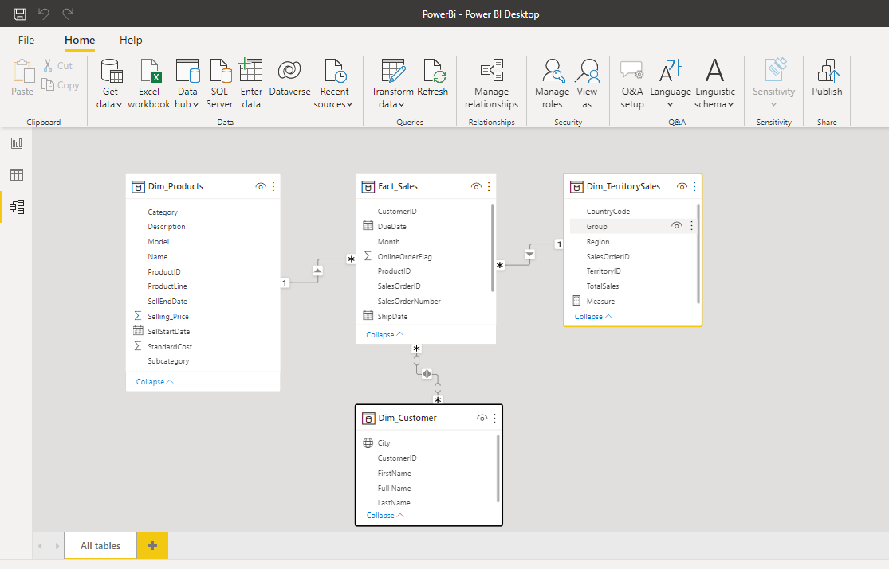
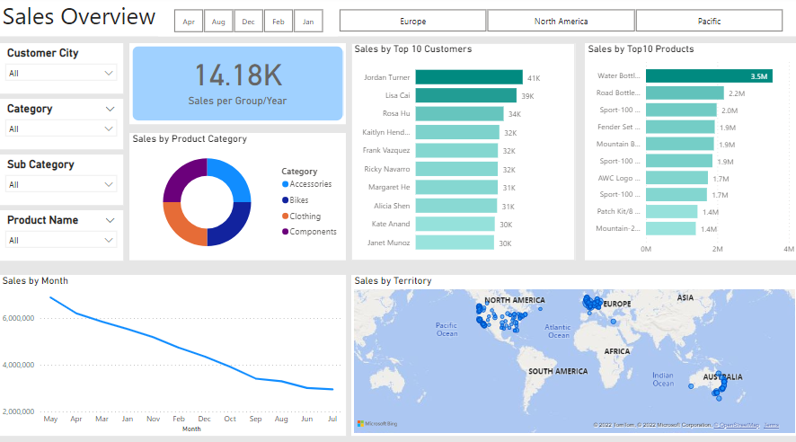
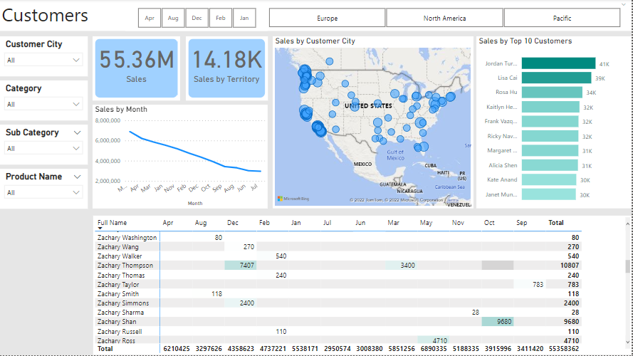
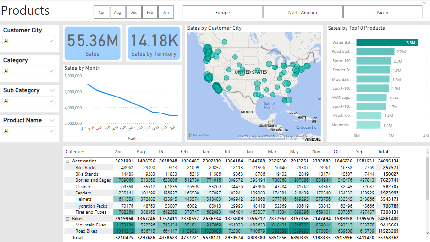

## Business Request

For this data analysis project, the business request is an executive sales report for sales managers.
The following user stories were defined to fulfill delivery and ensure that acceptance criteria is
maintained throughout the project. 

| As a (role) | I want (request / demand)| So that I (user value)                                                                         | Acceptance Criteria                                                                   |
|---|-------------------------|------------------------------------------------------------------------------------------------|---------------------------------------------------------------------------------------|
| Sales Manager | To get a dashboard overview  of internet sales | Can follow better  which customers  and products sells  the best                   | A Power BI  dashboard which  updates data once  a day                     |
| Sales Representative  | A detailed overview of  Internet Sales per Customers | Can follow up my  customers that  buys the most   and who we can  sell more to | A Power BI   dashboard which  allows me to filter  data for each customer | 
| Sales Representative  | A detailed overview of  Internet Sales per Products | Can follow up my  Products that  sells the most | A Power BI  dashboard which  allows me to filter  data for each  Product                  |

## Data Cleansing & Transformation (SQL)

To meet the business needs, the following tables were extracted to create the 
necessary data model. 

In the repository directory you will find the SQL statements used for cleansing and transforming the data. 

## Data Model

Below is the screenshot of the data model in Power BI. It shows how Fact_Sales table has been connected
to the other dimension tables.

## Sales Management Dashboard

The images below shows the sales management dashboards. The first image 
shows a general overview of the sales dashboard. The second and third images
focus on sales per customers and per products respectively, combining different visualization tools.

## Resources Used
- SQL Server Management Studio (SSMS)
- **AdventureWorks2019.bak** 
- PowerBI

